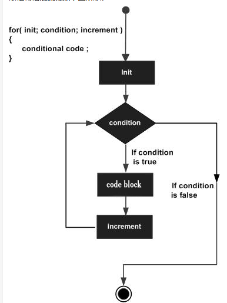

## 一 流程控制之-条件语句
**1.1 判断语句 if**


`if`判断示例：
```go
// 初始化与判断写在一起： if a := 10; a == 10
if i == '3' {			
}
```
`if`的特殊写法：
```go
if err := Connect(); err != nil {         // 这里的 err!=nil 才是真正的if判断表达式
}
```
**1.2 分支语句 switch**


示例：
```go
switch num {
   case 1:                          // case 中可以是表达式
      fmt.Println("111")
   case 2:
      fmt.Println("222")
   default:
      fmt.Println("000")
}
```
switch 语句用于基于不同条件执行不同动作，每一个 case 分支都是唯一的，从上至下逐一测试，直到匹配为止。

```go
switch var1 {
    case val1:
        ...
    case val2:
        ...
    default:
        ...
}
```

```go
package main

import "fmt"

func main() {
   /* 定义局部变量 */
   var grade string = "B"
   var marks int = 90

   switch marks {
      case 90: grade = "A"
      case 80: grade = "B"
      case 50,60,70 : grade = "C"
      default: grade = "D"  
   }

   switch {
      case grade == "A" :
         fmt.Printf("优秀!\n" )    
      case grade == "B", grade == "C" :
         fmt.Printf("良好\n" )      
      case grade == "D" :
         fmt.Printf("及格\n" )      
      case grade == "F":
         fmt.Printf("不及格\n" )
      default:
         fmt.Printf("差\n" );
   }
   fmt.Printf("你的等级是 %s\n", grade );      
}
```

Type Switch 

switch 语句还可以被用于 type-switch 来判断某个 interface 变量中实际存储的变量类型。

Type Switch 语法格式如下：

```go
switch x.(type){
    case type:
       statement(s);      
    case type:
       statement(s); 
    /* 你可以定义任意个数的case */
    default: /* 可选 */
       statement(s);
}
```


```go
package main

import "fmt"

func main() {
   var x interface{}
     
   switch i := x.(type) {
      case nil:  
         fmt.Printf(" x 的类型 :%T",i)                
      case int:  
         fmt.Printf("x 是 int 型")                      
      case float64:
         fmt.Printf("x 是 float64 型")          
      case func(int) float64:
         fmt.Printf("x 是 func(int) 型")                      
      case bool, string:
         fmt.Printf("x 是 bool 或 string 型" )      
      default:
         fmt.Printf("未知型")    
   }  
}
```

 一分支多值 

不同的 case 表达式使用逗号分隔。

```go
var a = "mum"
switch a {
    case "mum", "daddy":
    fmt.Println("family")
}
```

 2) 分支表达式 

```go
var r int = 11
switch {
    case r > 10 && r < 20:
    fmt.Println(r)
```


贴士：

- Go保留了`break`，用来跳出switch语句，上述案例的分支中默认就书写了该关键字
- Go也提供`fallthrough`，代表不跳出switch，后面的语句无条件执行
## 二 流程控制之-循环语句

**2.1 for循环**

Go只支持for一种循环语句，但是可以对应很多场景：
```go
// 传统的for循环for init;condition;post{}
// for循环简化var i intfor ; ; i++ {   if(i > 10){      break;   }}
// 类似while循环for condition {}
// 死循环for{}
// for range:一般用于遍历数组、切片、字符串、map、管道for k, v := range []int{1,2,3} {}
```
Go 语言的 For 循环有 3 种形式，只有其中的一种使用分号。

```go
//和 C 语言的 for 一样：
for init; condition; post { }
//和 C 的 while 一样：
for condition { }
//和 C 的 for(;;) 一样：
for { }
```

●init： 一般为赋值表达式，给控制变量赋初值；

●condition： 关系表达式或逻辑表达式，循环控制条件；

●post： 一般为赋值表达式，给控制变量增量或减量。


for语句执行过程如下：

●1、先对表达式 1 赋初值；

●2、判别赋值表达式 init 是否满足给定条件，若其值为真，满足循环条件，则执行循环体内语句，然后执行 post，进入第二次循环，再判别 condition；否则判断 condition 的值为假，不满足条件，就终止for循环，执行循环体外语句。

```go
//和 C 语言的 for 一样：
for init; condition; post { }
//和 C 的 while 一样：
for condition { }
//和 C 的 for(;;) 一样：
for { }
```




2for 循环的 range 格式可以对 slice、map、数组、字符串等进行迭代循环。格式如下：

```go
for key, value := range oldMap {
    newMap[key] = value
}
```

```go
package main
import "fmt"

func main() {
        strings := []string{"bobby", "imooc"}
        for i, s := range strings {
                fmt.Println(i, s)
        }
        numbers := [6]int{1, 2, 3, 5}
        for i,x:= range numbers {
                fmt.Printf("第 %d 位 x 的值 = %d\n", i,x)
        }  
}
```


**2.2 跳出循环**

常用的跳出循环关键字：

- `break`用于函数内跳出当前`for`、`switch`、`select`语句的执行
- `continue`用于跳出`for`循环的本次迭代。
- `goto`可以退出多层循环
break跳出循环案例(continue同下)：
```go
OuterLoop:
   for i := 0; i < 2; i++ {
      for j := 0; j < 5; j++ {
         switch j {
            case 2:
               fmt.Println(i,j)
               break OuterLoop
            case 3:
               fmt.Println(i,j)
               break OuterLoop
         }
      }
   }
```

goto跳出多重循环案例：
```go
for x:=0; x<10; x++ {    for y:=0; y<10; x++ {
        if y==2 {            goto breakHere         }   }   }breakHere:   fmt.Println("break")
```
贴士：goto也可以用来统一错误处理。
```go
if err != nil {
   goto onExit
}
onExit:
   fmt.Pritln(err)
   exitProcess()
```

