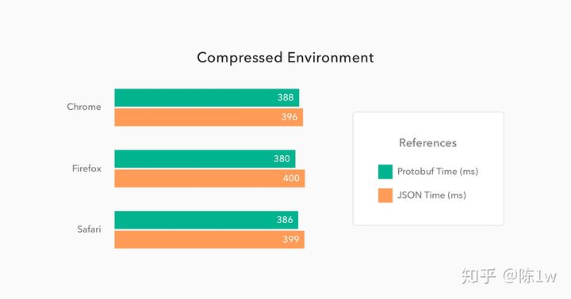
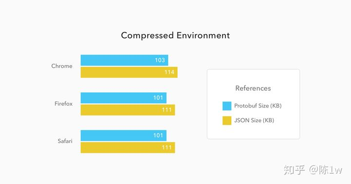
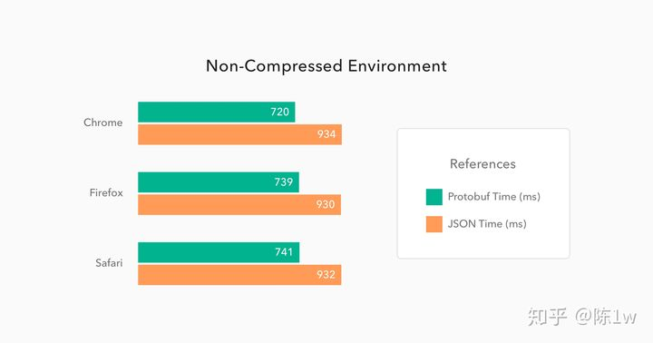
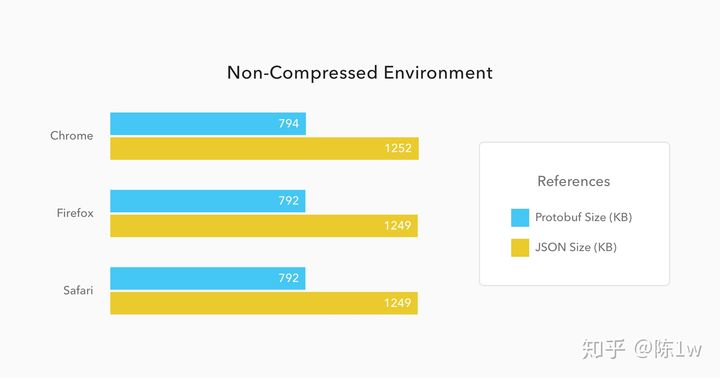
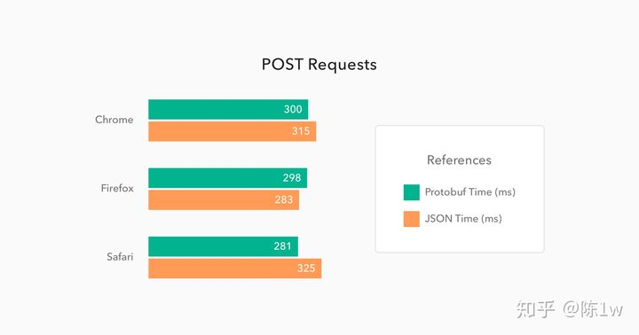
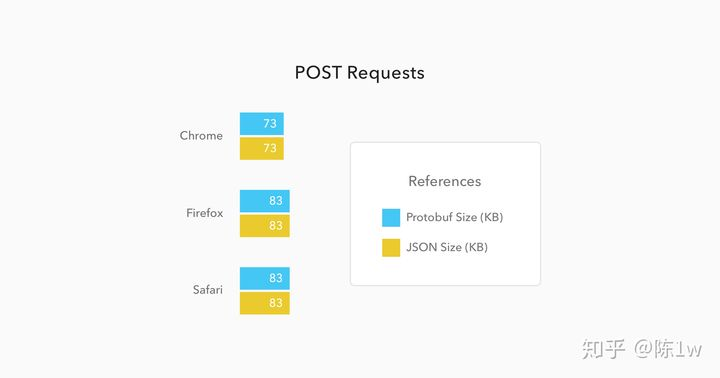

## grpc 

gRPC 是一个高性能、开源和通用的 RPC 框架，面向移动和 HTTP/2 设计。目前提供 C、Java 和 Go 语言版本，分别是：[grpc](https://github.com/grpc/grpc), [grpc-java](https://github.com/grpc/grpc-java), [grpc-go](https://github.com/grpc/grpc-go). 其中 C 版本支持 [C](https://github.com/grpc/grpc), [C++](https://github.com/grpc/grpc/tree/master/src/cpp), [Node.js](https://github.com/grpc/grpc/tree/master/src/node), [Python](https://github.com/grpc/grpc/tree/master/src/python), [Ruby](https://github.com/grpc/grpc/tree/master/src/ruby), [Objective-C](https://github.com/grpc/grpc/tree/master/src/objective-c), [PHP](https://github.com/grpc/grpc/tree/master/src/php) 和 [C#](https://github.com/grpc/grpc/tree/master/src/csharp) 支持.

[grpc/grpc](https://github.com/grpc/grpc)

##  protobuf 

java中的dubbo dubbo/rmi/hessian messagepack 如果你懂了协议完全有能力自己去实现一个协议

●习惯用 Json、XML 数据存储格式的你们，相信大多都没听过Protocol Buffer

●Protocol Buffer 其实 是 Google出品的一种轻量 & 高效的结构化数据存储格式，性能比 Json、XML 真的强！太！多！

●protobuf经历了protobuf2和protobuf3，pb3比pb2简化了很多，目前主流的版本是pb3

只有通过proto文件才能了解数据结构自解释性差json可以任何语言都支持，但是protobuf需要专门的解析库通用性差缺点支持各种主流语言跨平台跨语言传输速度快压缩性好比xml和json快2-100倍序列化和反序列化快性能加密性好自动生成序列化和反序列化代码使用简单不必破坏旧格式向后兼容只维护proto文件维护成本低便捷性优点protobuf

## protobuf 与 JSON的对比

我创建了三个Protobuf消息：`Address`：包括街道和数字; `Person`：包括姓名、地址集合、手机号码集合、电子邮件集合; `People`：包括Person消息的集合。我运用以上这些消息创建了四个RESTful接口：

1. 一个接受GET方式并以Protobuf格式返回5万人名单列表的接口。
2. 一个接受GET方式并以格式返回5万人名单列表的接口。
3. 以Protobuf格式接受任意数量人员的POST接口。
4. 以JSON格式接受任意数量人员的POST接口。

### JavaScript 与 Java 间的通信

有许多可用的JavaScript引擎，我使用了以下浏览器：Chrome，因为这是最受欢迎的浏览器，它的JavaScript引擎也被Node.js使用; Firefox，因为这是另一个非常受欢迎的浏览器; Safari，因为这是MacBooks和iPhone上的默认浏览器。

下图展示了这些浏览器对接口1和接口2发出50个持续的GET请求的平均性能。 分两次测试：1. 首先运行Spring Boot应用程序并打开压缩; 2. 然后在关闭压缩的情况下运行应用程序。 也就是每个浏览器发出了两百次请求。

如上图所示，压缩环境下Protobuf和JSON的结果非常相似。Protobuf消息比JSON消息小9％，减少了4%的时间。这听起来像什么都没有，但考虑到浏览器端Protobuf必须从二进制转换为JSON（JavaScript代码使用JSON作为其对象文字格式) - 令人惊讶的速度。

当我们在non-compressed环境时，结果会发生很大变化。 我们来分析下面的图表：

在与JSON相比，Protobuf表现更好。 消息体积减少了34％，快了21％。

当发出POST请求时，差异几乎是难以察觉的，因为通常这种请求不会处理繁重的消息体。 通常这些POST请求只是处理表单或类似内容上的一些字段的更新。 因此，我发出了50个请求，只有一个Person消息和一些属性，如电子邮件地址和移动设备。 结果如下：

在这种情况下， 发出请求并获得响应的时间几乎相等，与JSON请求相比，Protobuf请求的性能仅提高了4％。

